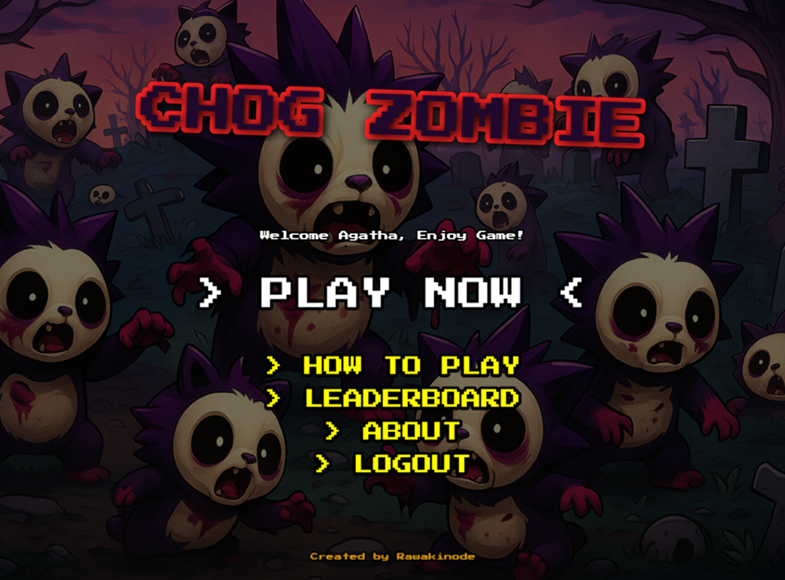

# Chog Zombie Monad 🧟‍♂️🔫
Chog Zombie Monad is a simple endless survival game where the player must shoot Chog Zombies coming from all directions. There is no end — survive as long as possible and reach the highest score!

# 🎮 Features

- Endless waves of Chog Zombies attacking from every direction
- Scoring system: the longer you survive, the higher your score
- Flexible controls: Keyboard (WASD / Arrow Keys) & Pointer + click to shoot
- Shooting & particle effects: bullets, muzzle flash, hit particles, camera shake
- Privy Monad Games ID integration for login & on-chain leaderboard

# 🚀 Getting Started
### 1. Clone the repository

```bash
git clone https://github.com/rawakinode/chog-zombie-monad.git
cd chog-zombie-monad
```

### 2. Install dependencies
```bash
npm install
```

### 3. Run the game (development)
```bash
npm run dev
```

### 4. Build for production
```bash
npm run build
```

# 🎯 How to Play

1. Aim the target/cursor at zombies
2. Click / Tap to shoot
3. Use WASD / Arrow keys
4. Survive as long as possible, don’t let the zombies get you

# 📸 Screenshot



# ⚠️ Disclaimer

- Chog Zombie Monad is a fun game project, created for entertainment and educational purposes only.
- All characters, zombies, and references are fictional — they do not represent any real person or entity.
- The game does not promote violence, it’s purely a playful survival challenge.
- Scores, items, or characters in this project do not have real monetary value, unless explicitly stated in future updates.
- This project is open-source and comes with no warranties — use it at your own risk.

# 🤝 Contributing

Pull requests are welcome! For major changes, please open an issue first to discuss what you’d like to change.

